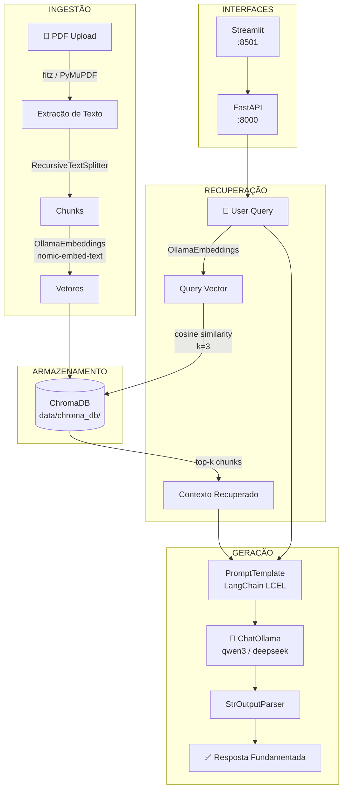
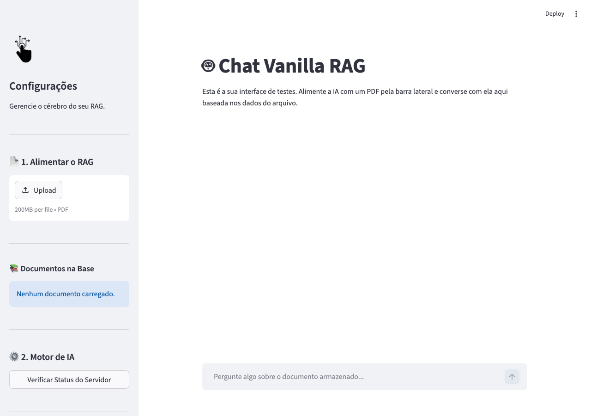

# giulia-rag-vanilla (PRJ-01 Vanilla RAG)

**Pipeline RAG fundacional com LLM local — sem nuvem, sem custos de API, sem vibe coding.**


---

## O que é

Sistemas corporativos acumulam conhecimento em documentos PDF que nenhuma ferramenta genérica consegue consultar com precisão. Modelos de linguagem sem contexto inventam respostas. A combinação mata a confiança do usuário.

Vanilla RAG resolve isso com a arquitetura mais direta possível: o PDF entra, é quebrado em chunks, vetorizado localmente e recuperado por similaridade semântica antes de cada resposta. O LLM só fala sobre o que está no documento.

O diferencial desta implementação é a ausência de dependências externas. Ollama roda o modelo de embedding e o LLM de inferência na mesma máquina. ChromaDB persiste os vetores em disco. FastAPI expõe a API. Streamlit entrega a interface. Nenhuma chamada sai da rede local.

---

## Arquitetura e Engenharia Rigorosa

Este projeto foi desenvolvido sob as diretrizes estritas do ecossistema de inteligência **GIULIA AI**, fundamentado em três pilares principais de engenharia de software de ponta:

1. **BMAD (Baseline Markdown Architecture Document):** Arquitetura descrita formalmente com fluxos claros e separação estrita de camadas.
2. **SDD (Spec-Driven Development):** Todas as regras de negócio, limites operacionais e comportamentos de exceção foram especificados *antes* de escrever qualquer linha de código comercial.
3. **TDD (Test-Driven Development):** Suíte de testes automatizados formais validando a saúde da infraestrutura, comportamento em cenários sem contexto e validações estritas de API.



### Interface Visual (Streamlit)

A aplicação conta com uma interface de chat intuitiva construída em Streamlit, permitindo o upload de PDFs pela barra lateral e interações em tempo real.


*💡 Captura de tela gerada automaticamente pelo Playwright durante o pipeline de validação v4.0.*

---

## Cobertura e Garantia TDD

A suíte de testes do projeto (localizada na pasta `/tests`) é totalmente compatível com o `pytest` e valida os seguintes comportamentos especificados na nossa documentação de SDD:

* **T01-01 (`test_chromadb_health`):** Garante a saúde e a inicialização sem falhas da base vetorial do ChromaDB local.
* **T01-02 (`test_rag_pipeline_empty_context`):** Valida a regra de negócios crucial de que a aplicação deve recusar-se a responder (devolvendo uma instrução elegante para upload) caso nenhum documento tenha sido indexado no banco vetorial, evitando alucinações.
* **T01-03 (`test_api_validation`):** Garante a resiliência do backend da API, retornando o código HTTP `422 Unprocessable Entity` quando payloads incompletos ou malformados são enviados.

Para executar a suíte de testes formais locais:
```bash
pytest tests/ -v
```

---

## Diferenciais Técnicos

**Execução 100% local.** Nenhum token sai da máquina. Dados sensíveis permanecem on-premise. Custo de API: R$ 0.

**Caminhos dinâmicos absolutos.** O projeto roda sem modificação em macOS, Linux (AWS, GCP) e Windows WSL. `os.path` calculado a partir da raiz do repositório.

**Separação de Preocupações (SoC) rigorosa.** `src/core/` contém apenas lógica de IA. `src/api/` contém apenas rotas e schemas Pydantic. `frontend/` contém apenas a interface Streamlit. `data/` contém ChromaDB e uploads — ignorados pelo `.gitignore`.

**Troca de modelo via `.env`.** Alterar `OLLAMA_MODEL=qwen3` ou `OLLAMA_MODEL=deepseek-r1` sem tocar no código. O engine detecta e faz pull automático se o modelo não estiver disponível localmente.

**Auto-inicialização do Ollama.** Se o daemon não estiver rodando, `ensure_ollama_running()` inicia e aguarda o healthcheck antes de prosseguir.

---

## Como Rodar

### Pré-requisitos

```bash
# 1. Ollama instalado e com pelo menos um modelo
curl -fsSL https://ollama.com/install.sh | sh
ollama pull nomic-embed-text   # modelo de embedding (obrigatório)
ollama pull qwen2.5:7b         # ou qualquer outro LLM local

# 2. Python 3.11+
python3 --version
```

### Instalação

```bash
git clone https://github.com/wganalytics/giulia-rag-vanilla.git
cd giulia-rag-vanilla

python3 -m venv .venv
source .venv/bin/activate       # Windows: .venv\Scripts\activate

pip install -r requirements.txt
```

### Configuração

```bash
# Copiar template de configuração
cp .env.example .env

# Editar conforme sua máquina
# OLLAMA_HOST=http://localhost:11434
# OLLAMA_MODEL=qwen2.5:7b
# OLLAMA_EMBED_MODEL=nomic-embed-text
```

### Execução

```bash
# Terminal 1 — API backend
uvicorn src.main:app --reload --port 8000

# Terminal 2 — Interface web
streamlit run frontend/streamlit_app.py --server.port 8501
```

Acesse `http://localhost:8501`, faça upload de um PDF pela barra lateral e comece a fazer perguntas.

---

## Especificações Técnicas e de Design (SDD)

O documento oficial de especificação arquitetural, limites operacionais e politicas contra alucinação do projeto pode ser lido na pasta pública:
👉 [PRJ-01 Vanilla RAG SDD Specification](docs/specs/PRJ-01_Vanilla_RAG_SDD.md)

---

## Métricas do Projeto

| Métrica | Valor |
|---------|-------|
| Arquivos Python | 9 |
| Linhas de código | 698 |
| Casos de Teste pytest | 4 |
| Dependências externas de nuvem | 0 |
| Custo de API em produção | R$ 0,00 |
| Modelos LLM suportados | Qualquer modelo Ollama |

---

## Ecossistema GIULIA AI

Vanilla RAG é o **PRJ-01** — o alicerce técnico de uma série de 9 projetos RAG desenvolvidos com engenharia real:

| # | Projeto | Técnica |
|---|---------|---------|
| **01** | **giulia-rag-vanilla** ← você está aqui | RAG Fundacional |
| 02 | giulia-rag-memory | RAG + Memória Redis |
| 03 | giulia-rag-hyde | HyDE (Hypothetical Document Embeddings) |
| 04 | giulia-rag-hybrid | BM25 + Vector + RRF |
| 05 | giulia-rag-adaptive | Roteamento Adaptativo |
| 06 | giulia-rag-corrective | CRAG com validação |
| 07 | giulia-rag-agentic | ReAct Loop Agêntico |
| 08 | giulia-rag-multimodal | PDFs com imagens e tabelas |
| 09 | giulia-rag-graph | GraphRAG com Neo4j |

---

## Autor

**Wemerson Guilherme**
Engenheiro de IA · Especialista em RAG e Arquiteturas LLM

[](https://linkedin.com/in/wemerson-guilherme)
[](https://github.com/wganalytics)

---

## Licença

MIT — veja [LICENSE](LICENSE) para detalhes.

---

<p align="center">
  <sub>Construído com engenharia real. Sem vibe coding.</sub><br>
  <sub>GIULIA AI Engineering Ecosystem · PRJ-01 · 2026</sub>
</p>
