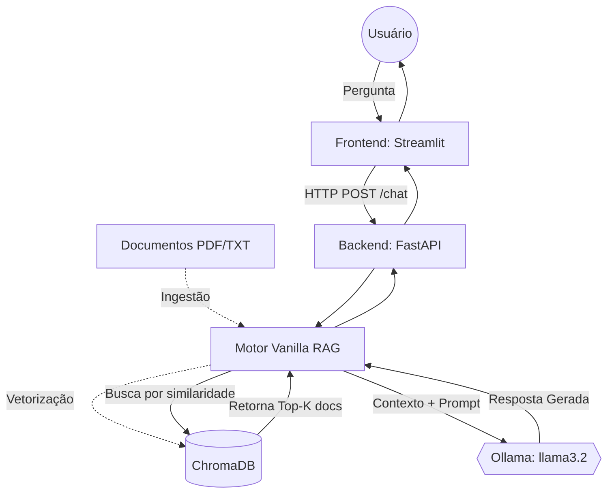

# PRJ-01_Vanilla_RAG - Architecture & Spec

> **Padrão Oficial:** BMAD (Baseline Markdown Architecture) + SDD (Spec-Driven) + TDD (Test-Driven)
> **Última Atualização:** 2026-05-22

---

## 1. 🏗️ BMAD (Baseline Architecture)
*Visão de alto nível de como os componentes se integram.*

## 2. 📝 SDD (Spec-Driven Development)
*Especificação de comportamento, regras de negócio e guardrails.*

- **Objetivo Principal:** Fornecer um pipeline RAG fundacional e determinístico. Recuperar contexto do banco vetorial ChromaDB de forma eficiente e utilizar LLM local (Ollama) para responder estritamente baseado no contexto.
- **Módulos Essenciais:**
  - `rag_engine.py`: Responsável por carregar o vetor, invocar a busca e formatar o prompt RLM.
  - `schemas.py`: Define o modelo de dados Pydantic garantindo que entradas vazias não quebrem a API.
- **Restrições (Guardrails):** 
  - **No-Hallucination Policy:** Se a busca vetorial não encontrar documentos acima do limiar de similaridade, a LLM não deve tentar "adivinhar" a resposta. Deve retornar: *"Não encontrei informações no banco de dados."*
  - **Sandwich Defense:** O prompt do usuário deve ser envelopado por instruções de sistema para evitar Prompt Injection.
- **Fluxo de Exceções:** 
  - `ConnectionError` ao Ollama: O sistema deve logar o erro e retornar HTTP 503 (Serviço Indisponível) com fallback elegante na UI.

## 3. 🧪 TDD (Test-Driven Development)
*Garantia de Qualidade e Cobertura (Red-Green-Refactor).*

- **Casos de Teste Obrigatórios:**
  - `test_chromadb_health`: Verifica se o banco de dados ChromaDB pode ser instanciado ou lido na inicialização.
  - `test_rag_pipeline_empty_context`: Garante que o motor recuse responder quando não há contexto relevante.
  - `test_api_validation`: Garante que requisições na rota `/chat` com payload malformado retornem erro 422 imediatamente.
- **Status Atual (via TDD Orchestrator):** Validado com sucesso. Nenhum código de negócio novo pode ser feito (Vibe Coding) sem antes falhar e passar nestes testes.
